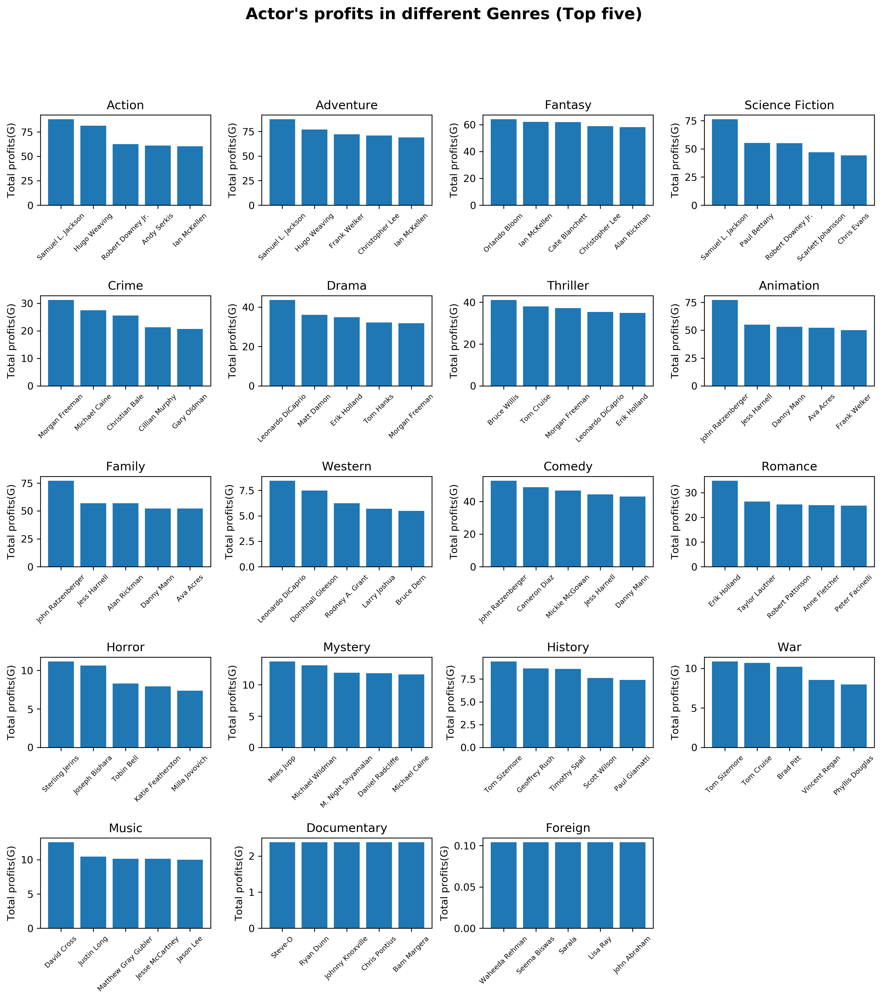

# What factors can make a financial success? And how to recommand a movie with keyword?

1. correlation between each factors for heatmap

Conclusion: runtime and rating of the movie have no relationship with revenue

1. Time series analysis compared by revenue, voting rating and number of movie

a. Analysis most successful season in the year (Month)

Conclusion: In decade average of revenue is not increased with time going but total number is

b. Analysis releasing time periods, adjusted for inflation (70s, 80s, 90s) (not necessary for presentation)

Conclusion: Summer and winter win

2. Directors and actors

Conclusion: help the companies to choose the director and actors based on genres

a. Most appearances

b. Revenue and rating

c. genres related for famous actors and directors (done for actors and deleted stan lee)

3. Genres related

Conclusion: Top 6 is animation, adventure, fantasy, family, science fiction and action. And a gap exists then

a. Classify highest rated movies by genre

b. Average and total revenue by genres

4. vote rating related

a. compare vote rating and number of movies (normal distribution)

Conclusion: it is a normal distribution appoximately

5. Keywords related

Conclusion: help the companies to choose the keywords based on genres

a. Most-used keywords

b. keywords compared with rating and profit

Possible source for such data

Recommandation of keyword:

TMDB 5000 dataset from kaggle